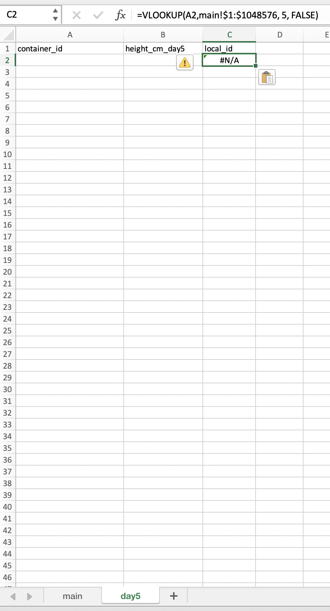
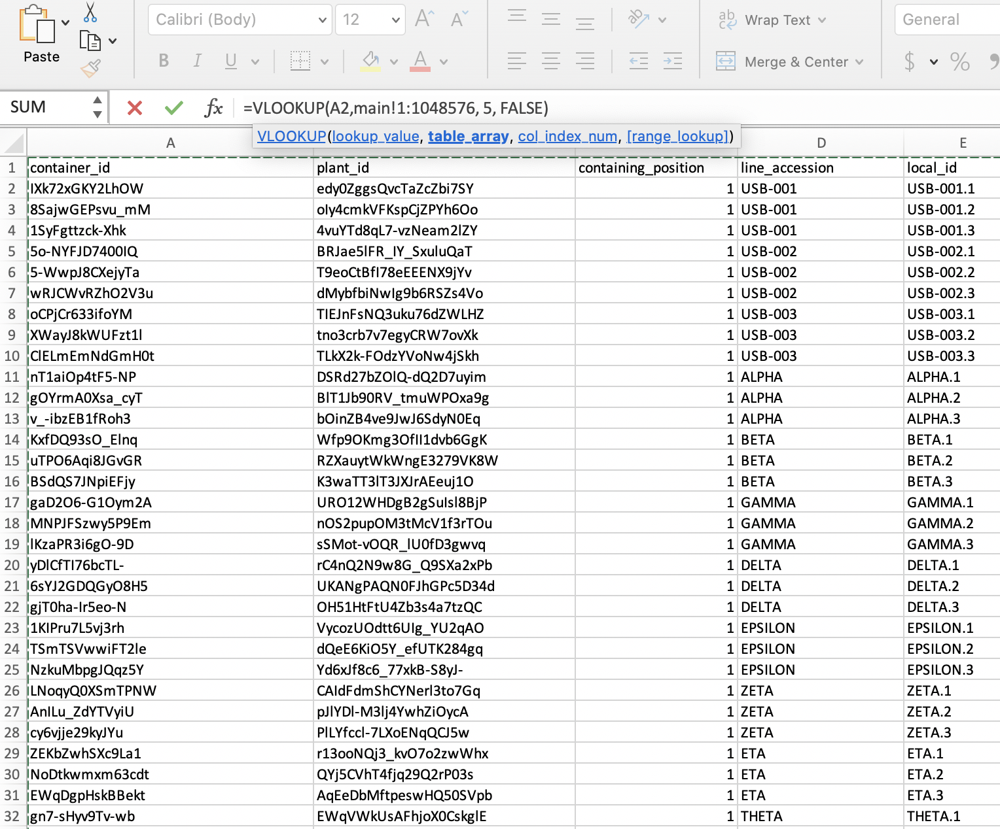

# Excel Barcode Scanner Guide
Excel technique that allows you to quickly scan a barcode (or QR code) to find a row and manually input a value associated with that row. In our lab we are using this to scan plants and record measurements while in the greenhouse.

# Steps
1. Obtain a barcode or QR code scanner which can be configured to add a custom suffix upon a scan. A lot of scanners have this functionality for carriage returns (`Enter`), but in our case we need it to be able to have `Tab` as the suffix. 
    1. We happened to go with this scanner: https://www.amazon.com/REALINN-Wireless-Rechargeable-Automatic-Warehouse/dp/B07W5Q48M5/. Refer to Page 16 of the [manual](https://github.com/Salk-Harnessing-Plants-Initiative/excel-barcode-scanner-guide/blob/main/RL6200W%20Manual%20V1.0.pdf) (`RL6200W Manual V1.0.pdf`) to configure the scanner to give `Tab` instead of carriage return and the end of each scan.
    
2. Open your Excel spreadsheet, and move your identifying column (barcode) to being the first column. (In our lab, this is `container_id` when we're scanning container labels, like when there's only one plant per container. Alternatively, this is `plant_id` when we're scanning plant labels, like when there's multiple plants per container and the label is directly on each plant). For this example, I'm named my main sheet `main`, and you can do the same if it makes the next steps easier.

3. Add a new blank sheet, which we will use to input data while working with the barcode scanner. Here I've named it `day5`. The first column will be used for barcode scans, and the second column will be for the new data you're trying to record manually alongside scanning. E.g., `container_id` and `height_cm_day5`. 

4. For quality control / sanity checking, add an additional column that will be used to reference another column in your `main` sheet. In this example, I go with `local_id`, since that's the column that will show me that the barcodes being scanned have been successfully found in `main`, and that when I scan it's the correct plant that I'm physically looking at. In that column you should use the formula `=VLOOKUP(A2,main!$1:$1048576, 5, FALSE)`.

*Sidenote: The formula `=VLOOKUP (value, table, col_index, [range_lookup])` is for searching a table for a value and giving the value of a designated column from the found row. `value` is the input to search for, `table` is the area to search in, `col_index` is the column to give back, and `[range_lookup]` must be `FALSE` to require the search to be exact rather than approximate. Refer to the [VLOOPKUP tutorial](https://exceljet.net/excel-functions/excel-vlookup-function) for more information.* ***Notably, I put `5` for `col_index` because my `local_id` is the fifth column, and `table` should just be the entirety of `main`.***

5. Now, use the formula dynamically for the whole column (drag it down).

6. Select the first empty cell of the barcode column.

7. Scan the barcode, and it'll go to the adjacent cell.

8. Type your input value, press enter to jump to the next row, then repeat.

9. Select your barcode column and set `Conditional Formatting` to prevent the risk of duplicate scans.

10. Finally, connect the data back to your `main` sheet by adding a column there and using `VLOOKUP` of your data input sheet: `=VLOOKUP(A2, 'day5'!$1:$1048576, 2, FALSE)`. You can refer to this to also check which of your plants are still missing values (since they show `#N/A`).

 

You can download `example_spreadsheet.xlsx` for the Excel document used in the steps below.

# Credit
Credit for the original solution goes to [steveingmc on Reddit](https://www.reddit.com/r/excel/comments/2p1xuf/locating_a_cell_or_item_using_a_bar_code_scanner/cmsxri4?utm_source=share&utm_medium=web2x&context=3):

> To start off we did do a a small bit of VBA to search the excel sheet once the Barcode had scanned, 
but the users didn't like it. They found it faster using the second way described below.
>
> We do something very similar at my work, generally used for stock taking. Here's how we do it.
>
> On the first sheet called [SystemData] we dump from our main system, 
>the stock list with the following data in Columns A to C
>
>Stock ID, Description and QTY
>
>On the second sheet named [Scan Data] The barcode scanner is programmed to scan the Item Barcode, 
>add the scanned data to column A and then send the TAB command moving the selected cell to column B, 
>which the User then enters the stock quantity.
>
>On this same sheet [Scan Data] is a preset Vlookup that references the [System Data] sheet columns A to C 
>and returns the Stock Description and Quantity. This is just a safe guard really and allows the user to see 
>that the scanned item appears in the master system list etc.
>
>Now back on the [System Data] sheet in column D we have another vlookup, looking back at columns A & B on sheet [Scan Data]
>This lookup looks for the new Quantity count and returns the value. If it cant find a lookup match, 
>i.e. returns a #N\A we know that either theres no stock or we missed that item when scanning, allowing us to go check.
>
>The final column on the [System Data] sheet is an IF statement comparing the System Stock Qty and the new Human entered value. 
>If they differ, the new count is returned, if they are the same, keep that value.
>
>There are a few condition formats, to highlight massive variances or where we have more counted stock 
>that the system thinks we should have.

